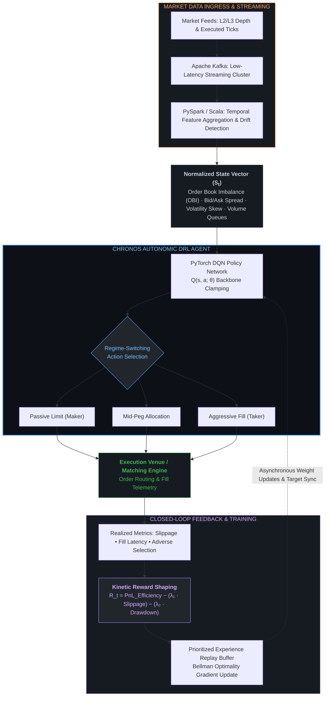

# CHRONOS: Deep Reinforcement Learning Liquidity Engine


**Architect:** Bijan Arianlou  
**Role:** Principal Systems Architect  
**Status:** Alpha Validation (v0.9)  
**Core Logic:** Deep Q-Network (DQN) Dynamic Liquidity Policy  

---

## 1. Architectural Intent

Chronos is an autonomous execution agent engineered to optimize liquidity entry and exit points across fragmented financial venues using Deep Reinforcement Learning (DRL). Moving beyond static algorithmic trading heuristics, Chronos implements a dynamic policy network that continuously adjusts execution vectors under non-stationary market regimes, maximizing risk-adjusted return (Sharpe Ratio) while suppressing market-impact slippage and kinetic drag.

The core optimization framework optimizes risk-penalized execution returns:

> **Reward** = PnL_Efficiency − (λ₁ · Slippage_Penalty) − (λ₂ · Max_Drawdown_Penalty)

---

## 2. Language & System Integration

### Core Reference Engine (Python 3.10)

- **PyTorch / Gymnasium:** Deep Q-Network policy backbones, target network stabilization, and custom execution environments.  
- **NumPy / SciPy:** Vectorized Bellman optimality updates, state-space covariance tracking, and numeric order book transforms.  
- Manages experience replay buffers, decay-schedules, and continuous Markov Decision Process (MDP) states.

### Enterprise Execution Layer (Distributed Streaming)

- **Apache Spark (PySpark / Scala):** Distributed temporal feature engineering, historical microstructure aggregation, and state-space drift detection.  
- **Apache Kafka:** Fault-tolerant, low-latency market depth feeds and level-2 tick streaming for continuous state vectorization.  
- Orchestrates asynchronous model checkpointing and telemetry logging without blocking hot-path execution.

---

## 3. Agent-Environment Interaction

Chronos models the market microstructure as a continuous feedback loop. At each temporal slice, the agent samples the normalized limit order book state, processes high-frequency signals, and selects an optimal allocation tactic:

- **Ingress & Streaming:** Market depth (L2/L3) and executed tick clusters stream via Apache Kafka into Spark temporal aggregation pipelines.  
- **State Vectorization:** Real-time extraction of normalized features: Order Book Imbalance (OBI), bid/ask spread, volatility, and volume skew.  
- **Policy Evaluation:** PyTorch DQN selects an optimal execution action (Passive Limit, Mid-Peg, or Aggressive Fill) under volatility regime clamping.  
- **Execution & Feedback:** Orders route to the target venue, and realized execution metrics (fill latency, slippage, and adverse selection) emit shaped reward signals back to the experience replay memory.  



---

## 4. Core Capabilities

- **Adaptive Regime-Switching Policy:** Uses Deep Q-Networks to discover latent state transitions and execute asymmetric routing between volatile and consolidated market states.  
- **Microstructure Awareness:** Evaluates real-time Order Book Imbalance (OBI), spread compression dynamics, and bid/ask volume queues.  
- **Kinetic Reward Shaping:** Mathematically penalizes transient drawdowns, adverse selection, and inventory risk holding costs.  
- **Distributed Drift Detection:** Continuously monitors feature distribution divergence across streaming Kafka pipelines to flag execution drift.  

---

## 5. Implementation Notice

This repository contains the **Reference Architecture and Environment Wrappers**. Production deployment mandates connection to low-latency matching engine gateways, specialized tick-data infrastructure, and hardware-accelerated state storage.

For institutional integration manifests, production distributed architectures, or proprietary backtest performance documentation:  
**Contact the Architect.**

---

## 6. Repository Structure

```text
/chronos-engine          # PyTorch DQN agents, policy graphs, and network weights
/environments           # Gymnasium continuous market simulation environments
/data-pipeline          # PySpark batch jobs and Kafka temporal stream consumers
/tests                  # Deterministic validation and invariant smoke checks
Dockerfile              # Multi-stage container deployment specification
requirements.txt        # Pinned dependency graph and build constraints
```
