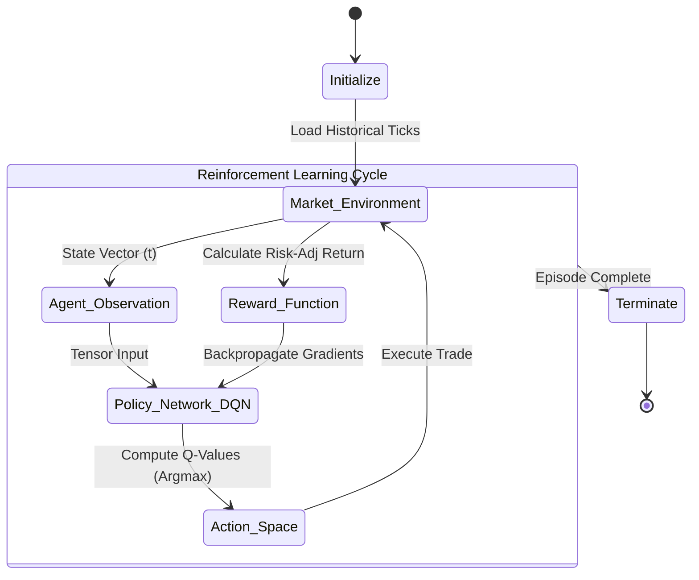

# Chronos: Deep Reinforcement Learning Liquidity Engine

**Architect:** Bijan Arianlou | **Role:** Principal Systems Architect
**Status:** Alpha Validation (v0.9) | **Core Logic:** Deep Q-Network (DQN)

---

## 1. Architectural Intent
Chronos is an autonomous execution agent designed to optimize liquidity entry/exit points using Deep Reinforcement Learning (DRL). Unlike static algorithmic trading scripts, Chronos utilizes a **Dynamic Policy Network** that adapts to changing market volatility regimes (Regime Switching), maximizing Sharpe Ratio while minimizing slippage.

## 2. Agent-Environment Interaction
The system operates on a continuous feedback loop where the Agent observes the Market State (Order Book + Volatility) and outputs an Action (Limit/Market Order), receiving a Reward based on PnL efficiency.

### Learning Loop (Live Render)

### Core Capabilities
*   **Adaptive Policy:** Uses Deep Q-Networks (DQN).
*   **Reward Shaping:** Minimizes drawdown.
*   **Microstructure Awareness:** Order Book Imbalance (OBI).

---

## Implementation Notice
This repository contains the **Environment Wrappers**.
> *Contact the Architect for backtest performance reports.*
  

